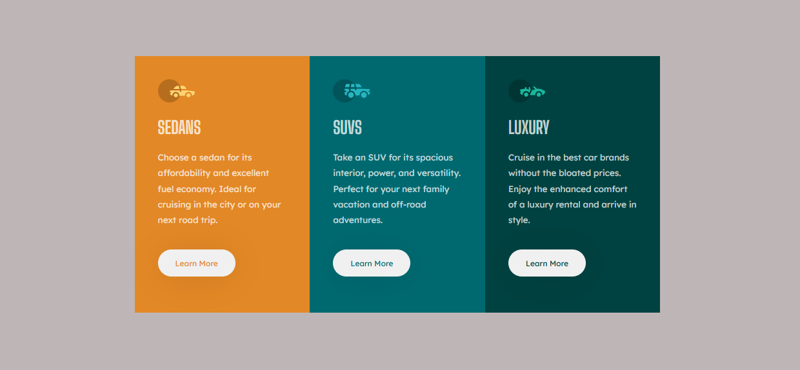
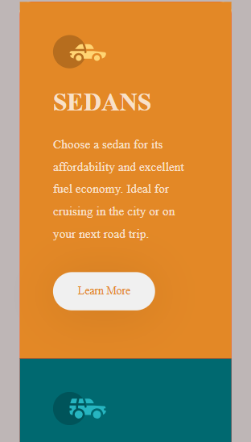
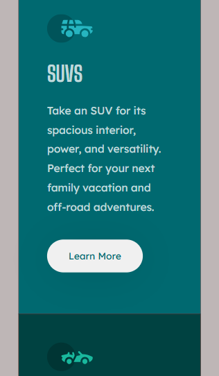
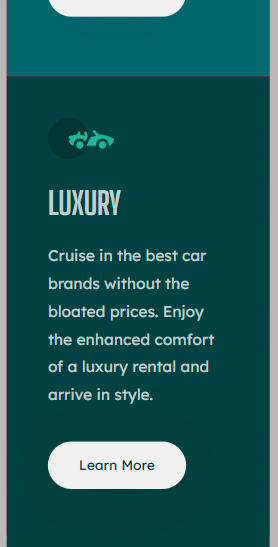

# Frontend Mentor - 3-column preview card component solution

This is a solution to the [3-column preview card component challenge on Frontend Mentor](https://www.frontendmentor.io/challenges/3column-preview-card-component-pH92eAR2-). Frontend Mentor challenges help you improve your coding skills by building realistic projects. 

## Table of contents

- [Overview](#overview)
  - [The challenge](#the-challenge)
  - [Screenshot](#screenshot)
  - [Links](#links)
- [My process](#my-process)
  - [Built with](#built-with)
  - [What I learned](#what-i-learned)
- [Author](#author)


## Overview

### The challenge

Users should be able to:

- View the optimal layout depending on their device's screen size
- See hover states for interactive elements

### Screenshot







### Links

- Live Site URL: [Add live site URL here](https://your-live-site-url.com)


### Built with

- Semantic HTML5 markup
- CSS custom properties
- Flexbox
- CSS Grid
- Mobile-first workflow


### What I learned


To see how you can add code snippets, see below:

```html
    <div class="item-3">
        
        <h1> LUXURY </h1>
        <p> Cruise in the best car brands without the bloated prices. Enjoy the enhanced comfort of a luxury 
            rental and arrive in style. </p>
        <button class="learn-more"> Learn More </button>
    </div>
```
```css
.learn-more {
    padding: 15px 30px;
    margin: 10% 0px;
    border: none;
    border-radius: 30px;
    box-shadow: 0 4px 60px rgba(0, 0, 0, 0.1);
    cursor: pointer;
    transition: background-color 0.3s, box-shadow 0.3s;
    text-align: center;
    font-family: Lexend Deca;
}
```


## Author

- Website - [Add your name here](https://www.your-site.com)
- Frontend Mentor - [@yourusername](https://www.frontendmentor.io/profile/yourusername)
- Twitter - [@yourusername](https://www.twitter.com/yourusername)


